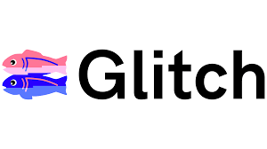
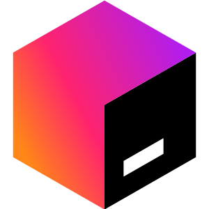

<h1 align="center"> Hi, I'm Violeta Vera!
  
   
  
<!--Vilu/visvs's Views here-->
   

  
<!-- Source of -> https://github.com/DenverCoder1/readme-typing-svg -->

  

</h1>
 
<samp>
I am a Computer Systems Engineering student. I am enthusiastic, I love to learn and create new things, with interests mainly focused on web development 💻
</samp>

<h2> 🧠 My Stack </h2>
<h3>👩🏻‍💻 Programming languages</h3>

  
  
  
  
  
  

<h3> 🗄️ Databases and Hosting</h3>

  
  
  
  
  
  

<h3> 💻 Software and Tools</h3>

  
  
  
  

<h3> ✍🏻 Frameworks and Libraries</h3>

  
  
  
  

<h2> 🦄 Github stats </h2>

<!--source of -> https://github.com/anuraghazra/github-readme-stats -->

 
  
 👩🏻‍💻 GitHub Profile Stats

   
    
  
   

<h2 align="center"> 📲 Contact</h2>

 
  
   
   

